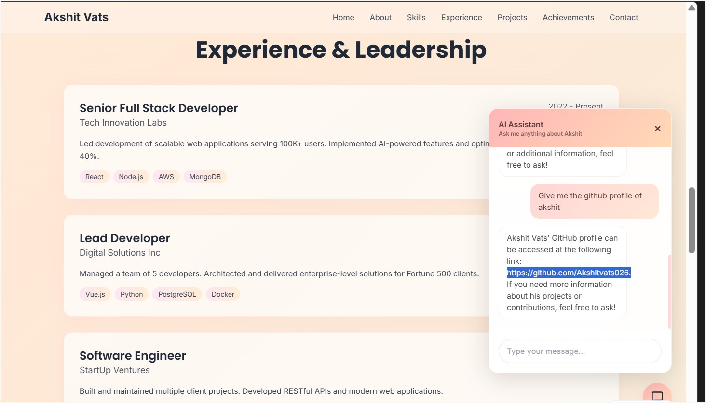

# 🚀 AI Portfolio Chatbot (RAG-Powered)

> An end-to-end **AI-powered portfolio chatbot** built using **n8n, OpenAI, and Pinecone**, implementing a **Retrieval-Augmented Generation (RAG)** architecture.  
> Integrated seamlessly into a personal portfolio website to deliver **accurate, knowledge-base-driven answers**.

---

## 📌 Overview

This project showcases a **production-ready GenAI system** where an AI assistant answers user queries **only from verified personal data**, including:
- Resume
- GitHub repositories
- LinkedIn profile
- Portfolio content

The chatbot avoids hallucinations by retrieving relevant information from a vector database before generating responses.

---

## ✨ Key Highlights

- 🤖 **RAG-based AI Chatbot**
- 🔗 **n8n AI Agent orchestration**
- 🧠 **Pinecone Vector Store** for semantic search
- 🧬 **OpenAI embeddings & chat model**
- 💬 **Session-based memory (multi-turn conversations)**
- 🌐 **Website-embedded chatbot**
- 🔐 **Safe text rendering (no HTML / XSS risks)**
- 🚀 **Production webhook setup**

---

## 🧠 System Architecture

```text
User (Website Chatbot)
        ↓
 Portfolio Website (JavaScript)
        ↓
 n8n Webhook
        ↓
 AI Agent (System Prompt + Memory)
        ↓
 Pinecone Vector Store (RAG)
        ↓
 OpenAI Chat Model
        ↓
 Respond to Webhook
        ↓
 User
```
---

🛠️ Tech Stack
Backend & Automation

n8n – Workflow automation & AI Agent

OpenAI API – Embeddings & chat completion

Pinecone – Vector database (knowledge base)

Webhooks – Frontend ↔ backend communication

Frontend

HTML / CSS / JavaScript

Custom chatbot UI

Session handling using localStorage

---

📂 Project Structure
├── index.html                 # Portfolio website
├── main.js                    # Chatbot logic (frontend)
├── styles.css                 # UI styling
├── assets/
│   └── screenshots/
│       ├── n8n-workflow.png
│       ├── chatbot-ui.png
│       ├── pinecone-index.png
├── README.md

---

## 🔧 n8n Workflow Breakdown

The n8n automation consists of the following nodes:

Webhook

Receives user message + sessionId

AI Agent

System instructions

Tool calling

Simple Memory

Maintains session-based context

Pinecone Vector Store

Retrieves relevant knowledge

OpenAI Embeddings

Converts query into vectors

Respond to Webhook

Sends response back to frontend

---

# 📸 n8n Workflow Screenshot


## 💬 Website Chatbot UI

The chatbot is embedded directly into the portfolio website and supports:

Real-time conversation

Typing indicator

Session persistence

Clean text formatting (markdown-safe)

---

# 📸 Chatbot UI Screenshot


## 🔐 Knowledge Base (RAG)

The chatbot answers questions only from indexed documents:

Resume (PDF)

GitHub repositories

LinkedIn profile

Portfolio data

❌ No hallucination
❌ No guessing
✅ Verified responses only

---

## 🧠 Memory Handling

Each user gets a unique sessionId

Stored in browser localStorage

Sent with every request to n8n

Enables smooth multi-turn conversations

## 🛡️ Security & Stability

Uses textContent (no innerHTML)

Markdown symbols safely handled

XSS-safe frontend

Stable webhook execution

---

# 🚀 How to Run
1️⃣ Clone the repository
git clone https://github.com/Akshitvats026/akshit-n8n-rag-agent.git
cd your-repo-name

2️⃣ Open the website
Open index.html in browser

3️⃣ Configure n8n

Import the workflow

Add OpenAI & Pinecone credentials

Use Production Webhook URL

⚙️ n8n Backend
https://akshu-automation.app.n8n.cloud

## 🏆 Why This Project Matters

This project demonstrates:

Real-world RAG implementation

Automation engineering using n8n

System design & AI integration

Full-stack AI development mindset

Production-grade chatbot architecture

---

## 👤 Author

Akshit Vats
Web Developer | Machine Learning | Generative AI

GitHub: https://github.com/Akshitvats026

LinkedIn: https://www.linkedin.com/in/akshitvats026

# ⭐ Support

If you like this project:

# ⭐ Star the repository

🍴 Fork it

---

## 💬 Share feedback

Built with ❤️ using n8n, OpenAI, and Pinecone
